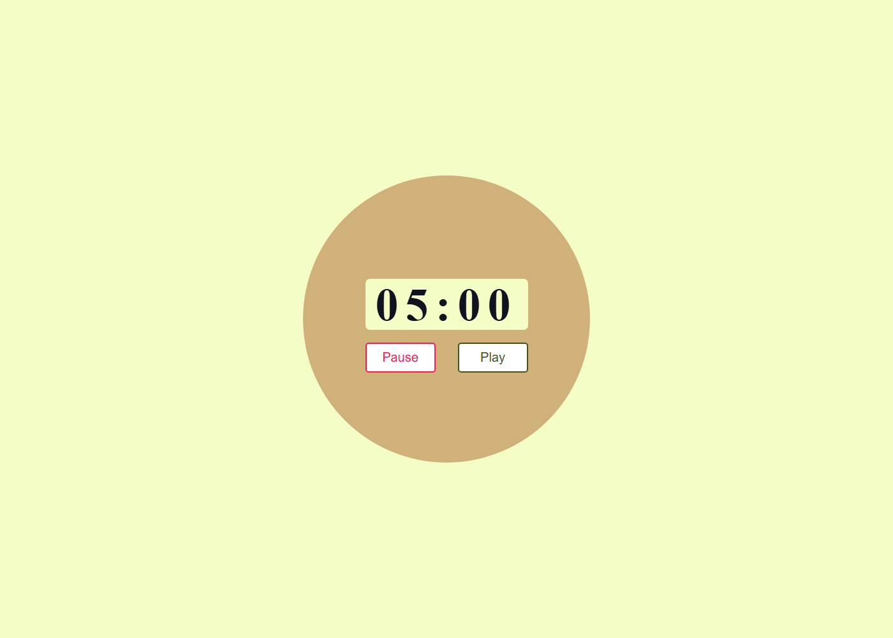
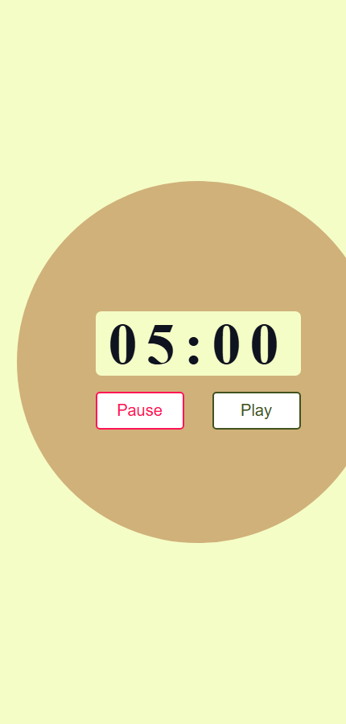

# ⏱️ JavaScript Timer

## 👀 Preview

### 💻 Desktop



### 📱 Mobile



This is a simple countdown timer built using HTML, CSS, and JavaScript. The timer starts from a preset time (5 minutes in this case) and counts down to zero. The user can pause and resume the countdown as needed.

---

## ✨ Features

- 📱 **Responsive Design**: The timer adjusts to different screen sizes.  
- ⏸️▶️ **Play/Pause Functionality**: The timer can be paused and resumed at any time.  
- 🔔 **Alert Notification**: An alert is displayed when the timer reaches zero.

---

## 🧪 How to Use

1. 📥 **Clone the repository**:

   ```bash
   git clone https://github.com/Iqbolshoh/javascript-timer.git
````

2. 📁 **Navigate to the project directory**:

   ```bash
   cd javascript-timer
   ```

3. 🌐 **Open `index.html` in your web browser**:

   ```bash
   open index.html
   ```

4. ⏳ **The timer will start at 5 minutes.** You can pause and resume using the "Pause" and "Play" buttons.

---

## 🖥 Technologies Used


## 📜 License
This project is open-source and available under the **MIT License**.

## 🤝 Contributing  
🎯 Contributions are welcome! If you have suggestions or want to enhance the project, feel free to fork the repository and submit a pull request.

## 📬 Connect with Me  
💬 I love meeting new people and discussing tech, business, and creative ideas. Let’s connect! You can reach me on these platforms:

<div align="center">
  <table>
    <tr>
      <td>
        <a href="https://iqbolshoh.uz" target="_blank">
          
        </a>
      </td>
      <td>
        <a href="mailto:iilhomjonov777@gmail.com" target="_blank">
          
        </a>
      </td>
      <td>
        <a href="https://github.com/iqbolshoh" target="_blank">
          
        </a>
      </td>
      <td>
        <a href="https://www.linkedin.com/in/iqbolshoh/" target="_blank">
          
        </a>
      </td>
      <td>
        <a href="https://t.me/iqbolshoh_777" target="_blank">
          
        </a>
      </td>
      <td>
        <a href="https://wa.me/998997799333" target="_blank">
          
        </a>
      </td>
      <td>
        <a href="https://instagram.com/iqbolshoh_777" target="_blank">
          
        </a>
      </td>
      <td>
        <a href="https://x.com/iqbolshoh_777" target="_blank">
          
        </a>
      </td>
      <td>
        <a href="https://www.youtube.com/@Iqbolshoh_777" target="_blank">
          
        </a>
      </td>
    </tr>
  </table>
</div>
